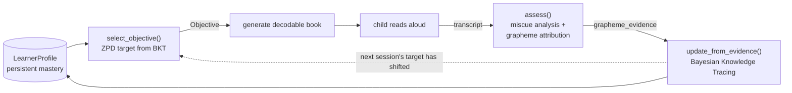
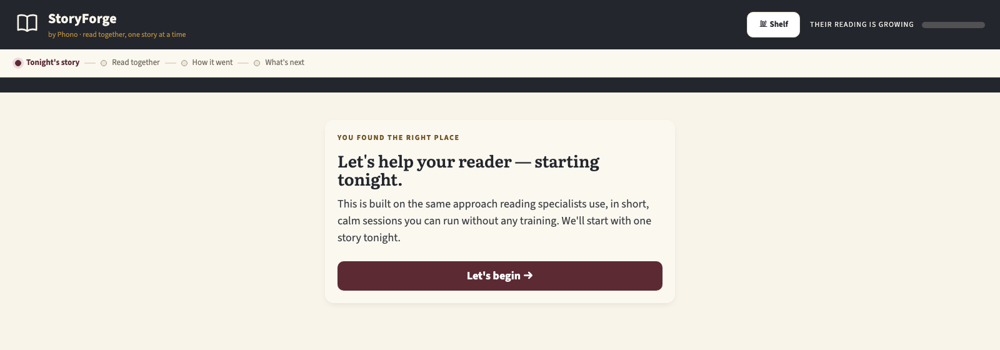
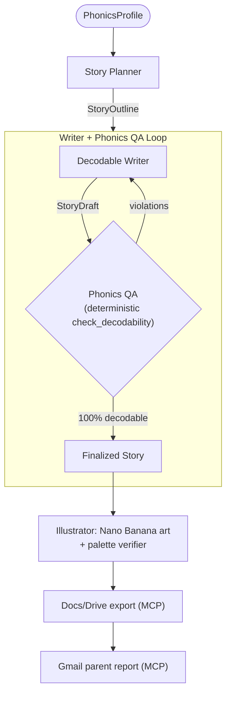

# Phono StoryForge


Phono StoryForge is a **closed-loop adaptive reading tutor** for early and struggling readers (dyslexia-aware), built on Google's Agent Development Kit (ADK). It doesn't just generate a decodable storybook once — it keeps a per-child mastery model, decides what phonics skill to teach next from that child's own reading evidence, generates a book guaranteed decodable at exactly that level, listens to the child read it, attributes every miscue down to the specific grapheme, updates the mastery model, and lets the *next* book change because of how this read went.

Built as the capstone project for Google/Kaggle's **5-Day AI Agents Intensive — Vibe Coding Capstone**, Track: **Agents for Good** (education).

## The Problem

Parents of dyslexic and struggling readers are told to "read decodable books at their level," but (1) decodable books at the *exact* combination of phonics level + interests + age a given child needs are scarce and generic, and (2) nothing adapts: there's no loop that watches what the child actually misreads and chooses what to practice next. Phono StoryForge closes that loop — content generation guaranteed decodable for *this* child, plus an evidence-driven tutor that targets their real gaps and adapts session over session.

## The thesis: a closed loop, not a one-shot generator

The spine of the project is one loop, run per child, per session:



Everything load-bearing here is **deterministic, non-LLM Python** that the project already implements and unit-tests:

| Step          | Module                                         | What it does                                                                                                                                              |
| ------------- | ---------------------------------------------- | --------------------------------------------------------------------------------------------------------------------------------------------------------- |
| Plan          | `app/skills/planner.py` `select_objective`     | Picks the lowest unmastered grapheme (ZPD) from the child's BKT estimate, plus spaced-review picks.                                                       |
| Decode/verify | `app/skills/decodability.py` `decompose`       | The keystone: maps any word → ordered graphemes tagged by phonics level. Powers decodability, targeting, and miscue attribution from one source of truth. |
| Assess        | `app/skills/alignment.py` `assess`             | Aligns expected vs. spoken text (running-record miscue types), then attributes each error down to the exact grapheme → `grapheme_evidence`.               |
| Update        | `app/skills/mastery.py` `update_from_evidence` | 4-parameter Bayesian Knowledge Tracing; turns evidence into an updated per-grapheme knowledge state.                                                      |
| Persist       | `app/store/`                                   | `LearnerProfile` (current mastery) + append-only `SessionLog` history.                                                                                    |

**The same code that runs the product loop is the code the evidence experiment exercises** (see *Evidence* below) — so the simulation isn't a detached toy; it's a calibration/regression harness for the production brain.

## Status (honest)


*The onboarding screen of the live web app (`scripts/tutor_web.py`) — the same real UI the loop below runs in, screenshotted from a running instance, not a mockup.*

- **Closed-loop tutor — a real, stateful product (Stage A, done).** `app/tutor/TutorSession` runs the full loop above against a persistent `LearnerStore`, exposed through a typed-transcript entry path (`scripts/tutor_cli.py`). Run it twice for a child with strong reads and the target visibly advances (e.g. `a` → `e` → `i`), mastery rises, and everything persists across processes.
- **Voice read-aloud + verifier-gated LLM books (Stage B, done).** Gemini Live transcribes the child's read-aloud (`app/voice/`, with a `FakeTranscriber` for offline tests) and feeds the *unchanged* `record_read()`; a verifier-gated LLM generator (`app/tutor/llm_book.py`, propose → `check_decodability` → revise) is wired into the loop as an optional content source behind the same `BookProvider` seam (`--llm-book`). Voice is creds-gated and degrades to typed input if Gemini Live is unavailable.
- **Web read-along + live mastery viz (Stage C, done).** A FastAPI + vanilla-JS app (`app/web/`, launched via `scripts/tutor_web.py`) drives the real loop in the browser over a WebSocket, behind the "Reading Room" redesign: a persistent **LoopRail** narrates the six loop steps (Plan → Generate → Verify → Read → Assess → Adapt), lighting up and checking off as each runs and its guardrail passes; a **"Why this book?"** card surfaces the planner's rationale as a judge-facing receipt; mastery renders as a **MasteryPath** — graphemes as nodes (mastered / current target / in-progress / locked) rather than an animating bar list; and a **Read ⇄ Insight** toggle splits a child-safe reading face (no red, no stats) from an adult/judge-facing insight face (miscue heatmap, mastery path, next-target). Browser-mic voice is layered on additively; the typed path stands alone if voice is flaky.
- **Decodable-book generation pipeline — built; deterministic export path live-verified with stubbed images, real-image end-to-end still pending.** A multi-stage ADK `SequentialAgent` writes a phonically-decodable story, illustrates it (real generated art, brand-palette-verified), and exports it to Google Docs/Drive with a Gmail parent report. Receipts: the deterministic Doc/Drive assembly (`app/doc_export.py`, `build_doc_requests`) is unit-tested and was live-export verified against a real Drive/Docs account using **stubbed** images (`PHONO_STUB_IMAGES`); the committed `results/sample_book/` PNGs prove real illustration generation; a full real-image-into-real-Doc run is **still pending**. This pipeline is no longer just a standalone path: the live per-session loop can trigger it directly from the web UI, reusing the same `story_planner`/QA-loop agents and exporting deterministically (`app/doc_export.py`) rather than via the agentic MCP exporter (which stays in `root_agent` for `adk web` and integration tests). The export path's earlier sandbox-path and credential-version bugs are fixed (verified with stubbed images).
- **What's honestly not done.** A self-improving content flywheel — every real session becomes an eval datapoint, with `check_decodability` as an always-on judge (roadmap item **D′**) — is planned but not built. The de-circularized evidence study (Stage D) is done; see *Evidence*. **The full offline `tests/unit` suite passes** (`uv run pytest tests/unit`).

## The content engine: verifier-gated decodable-book generation

The illustrated-book pipeline is the "generate decodable book" node of the loop, and it embodies the project's core pattern — **an LLM/image model proposes, deterministic Python verifies**:



- **Phonics QA guardrail:** a `LoopAgent` wrapping a custom `BaseAgent` re-runs the writer until `check_decodability` (the same `decompose`-based engine) confirms **zero** violations, or it halts. An undecodable word can't ship.
- **Brand-consistent illustration (propose/verify guardrail):** a per-book character bible + **Nano Banana** (`gemini-2.5-flash-image`, via Vertex) render each page; a **deterministic palette verifier** (`app/skills/palette_verifier.py`) proves every image stays on the brand palette defined in `app/brand.py` — the same propose/verify pattern as the phonics gate. Real images are embedded inline in the Doc, with a dyslexia-friendly body typeface for legibility. *(The specific palette and illustration style are implementation values currently in app/brand.py and are being reworked in a visual identity reboot — see DESIGN\_GUIDELINES.md. The guardrail mechanism is identity-independent: it enforces whatever palette brand.py defines.)*
- **MCP write paths + guardrails:** Google's official `@googleworkspace/cli` (`gws`) in MCP stdio mode exposes Drive/Docs/Gmail; export and Gmail-draft callbacks validate the real `doc_id`/`shareable_url`/draft-ID before the pipeline continues.
  - **Note — export path for the live web flow:** the illustrated-book action folded into the live tutor exports the Doc **deterministically** via `app/doc_export.py` (the same propose/verify discipline as the decodability QA loop and palette verifier — the LLM writes the text, deterministic code assembles the Doc), since the agentic LLM-drives-MCP export (`formatter_export_agent`) remains in `root_agent` for `adk web` / integration tests but is not reliable standalone.

Run `python -m scripts.build_sample_book` to produce a full illustrated decodable book end-to-end in Google Docs (sample committed under `results/sample_book/`).

## Evidence: adaptive beats a fixed sequence

`eval/experiments/adaptive_vs_static.py` runs two arms over the same paired, seeded simulated learners: **adaptive** (`select_objective` chooses each session's target from the child's BKT estimate) vs. **static** (a fixed scope-and-sequence that ignores the evidence). Both close the identical loop; both children read the same fixed benchmark probe each session so the fluency comparison is fair.

Result (n=30, 40 sessions): **probe accuracy +0.06, true mean latent mastery +0.04, +4.9 WCPM**. Fully deterministic and LLM-free, so it reproduces exactly. Chart + CSV under `eval/experiments/results/`.

> **On rigor (Stage D, de-circularized).** Those numbers are from an *independent* learner whose generative process is deliberately **not** what the tutor assumes — so the experiment is no longer self-validating. Two mismatches were introduced (`eval/simulated_learner.py`): (1) **emission** is a logistic/IRT curve with per-grapheme item difficulty, not the linear slip/guess that BKT inverts — the tutor must estimate mastery under a model it cannot represent; (2) **learning has no prerequisite/ZPD gate** (the planner's own thesis) — skills are learned by direct practice and *forget* when unpracticed, so adaptive can only win by revisiting each child's decaying frontier. The gaps roughly halve versus the earlier self-consistent learner but stay positive, and the accuracy advantage holds across all 12 cells of a forgetting/discrimination sweep (`eval/experiments/robustness_sweep.py`; narrowing to +0.002 at the harshest corner) — a smaller, more credible win. One honest wrinkle: on the count of graphemes pushed past a hard 0.95 mastery bar, adaptive and static are a wash (the fixed drill over-concentrates practice), even though adaptive wins on real reading accuracy, mean mastery, and fluency.

## Roadmap

| Stage  | Scope                                                                                                                                                 | Status    |
| ------ | ----------------------------------------------------------------------------------------------------------------------------------------------------- | --------- |
| **A**  | Wire the closed loop into a real stateful product (`app/tutor`, `SessionLog`, typed-transcript entry path)                                            | ✅ Done    |
| **B**  | Gemini Live voice read-aloud → transcript (replaces typed input); verifier-gated LLM book generator wired into the loop as an optional content source | ✅ Done    |
| **C**  | Web read-along UI + live mastery-graph visualization (the filmable demo)                                                                              | ✅ Done    |
| **D**  | De-circularized evidence study (independent learner + externally-validated `decompose`)                                                               | ✅ Done    |
| **D′** | Self-improving content flywheel (every real session → an eval datapoint)                                                                              | ⬜ Planned |

The voice loop (Stage B) drops in behind the existing `TutorSession.record_read(prepared, spoken)` signature unchanged — `spoken` simply arrives from ASR instead of stdin.

## Documentation map

The deeper write-ups live under [`docs/`](docs/):

| Document | What it covers |
| --- | --- |
| [docs/kaggle-writeup-FINAL.md](docs/kaggle-writeup-FINAL.md) | The capstone write-up — problem, architecture, evidence, and the "Agents for Good" case. |
| [docs/stage-d-independent-learner.md](docs/stage-d-independent-learner.md) | Stage D evidence and rigor: the de-circularized independent learner (logistic/IRT emission, no ZPD gate, forgetting) and what the adaptive-vs-static gaps do and don't show. |
| [docs/build-plan.md](docs/build-plan.md) | The staged build plan (A→D′) and the engineering decisions behind each stage. |

## Capstone concepts demonstrated

- **Multi-agent systems (ADK)** — a `SequentialAgent` orchestrating the generation pipeline, including a `LoopAgent` wrapping a custom `BaseAgent` QA guardrail.
- **Agent skills** — the deterministic `decompose`/`check_decodability` decodability engine, the BKT mastery model, the miscue-alignment assessor, and the ZPD planner are non-LLM skills the system reasons with.
- **Closed-loop / memory** — `LearnerProfile` is cross-session memory; `app/tutor` makes the tutor stateful and adaptive rather than one-shot.
- **Voice (Gemini Live)** — `app/voice` streams the child's read-aloud to Gemini Live for transcription and feeds the unchanged assessment loop; a confidence-repair hook and grapheme-localized scaffolding sit on top.
- **Live web app** — `app/web` (FastAPI + WebSocket) drives the real loop in a browser behind a LoopRail that narrates the six-step ADK loop live, a "Why this book?" judge-facing rationale receipt, a MasteryPath, and a child-safe Read / judge-facing Insight split (the filmable demo).
- **MCP server integration** — `gws` over MCP stdio exposes Drive/Docs/Gmail write tools.
- **Security / guardrails** — three independent guardrails halt rather than silently continue: the phonics decodability loop, the export-result validator, and the Gmail-draft validator.
- **Observability + deployability** — OpenTelemetry/GenAI telemetry wired at the FastAPI entrypoint (`app/app_utils/telemetry.py`, called from `app/fast_api_app.py`); `Dockerfile` + `agents-cli deploy` path to Cloud Run (not deployed live for this submission).

## Known Limitations

Documented honestly rather than glossed over:

- **Illustrated-book generation now reaches the live loop, with graceful degradation rather than a hard failure.** The illustrated-book ADK pipeline (Nano Banana art + Docs export) can be triggered directly from the live per-session loop (web UI), not just as a separate standalone path — see *Status* above. It degrades along two independent axes instead of failing outright: if illustration generation is unavailable, the result falls back to text-only pages; if Docs export is unavailable, it falls back to illustrated pages without a shareable Doc link.
- **Voice is creds-gated and not exercised in CI.** Gemini Live transcription is real (`app/voice`) but requires Live access; without it the web/CLI paths degrade to typed input. The "never-punish" confidence repair is currently a no-op on the live path (Live returns no per-word confidence today) — it only fires in tests via `FakeTranscriber`.
- **The evidence experiment has been de-circularized (Stage D, both halves done).** Previously the simulated learner and planner shared a ZPD assumption, making the result partly self-validating. Both leaks are now closed: the **segmenter half** — `decompose`/`_segment` (the basis of the "guaranteed decodable" claim) is externally validated against a hand-verified grapheme truth set and structural tiling laws swept over `/usr/share/dict/words` (\~210k words) in `tests/unit/test_decompose_corpus.py`; and the **learner-model half** — the simulated learner now uses a logistic/IRT emission with per-grapheme difficulty (not BKT's linear slip/guess) and learning with no prerequisite gate plus forgetting (not the planner's ZPD thesis), so the tutor faces a genuine model mismatch. Adaptive still beats static on reading accuracy, mean mastery, and fluency (gaps \~halved but positive across all 12 cells of a parameter sweep); it does *not* reliably win the count past a hard 0.95 mastery bar. The remaining honesty caveat: the learner's constants are reasonable but uncalibrated, and WCPM is still a deterministic function of error count, not an independent timing measurement.
- **Two gws postures, by necessity.** The project uses Google's `@googleworkspace/cli` (`gws`) two ways, and they need different versions. (1) The **deterministic export path** (`app/doc_export.py`) is **PATH-first** — it uses whatever `gws` you authenticated (`gws auth login`; e.g. 0.22.5 here), because the old 0.7.0 cannot decrypt credentials written by a newer gws (a 401 "decryption failed"), and falls back to a pinned `npx @googleworkspace/cli@0.7.0` only if no `gws` is on PATH. (2) The **agentic MCP path** (`app/agent.py`, used by `adk web` / integration tests) pins **0.7.0** because Google removed MCP server mode in `0.8.0` ([PR #275](https://github.com/googleworkspace/cli/pull/275)). So the deterministic path follows your installed gws while the MCP path is held at 0.7.0 — a deliberate split, not a single pin.
- **The eval grading harness has a JSON-parsing bug** unrelated to the agent: when the LLM-judge's `explanation` contains raw newlines, `agents-cli eval grade` fails to parse it. This affects automated eval scoring, not agent behavior — `tests/unit` and `tests/integration` pass cleanly (modulo live-API rate limits).
- **Deprecated ADK primitives (documented debt).** The generation pipeline uses ADK's `LoopAgent` / `SequentialAgent`, which ADK has deprecated in favor of `Workflow` (they still run — `uv.lock` pins a working ADK and the tests pass — but emit deprecation warnings). Migrating to `Workflow` is deferred, not done.

## Project Structure

```text
agy-capstoneproject/
├── app/
│   ├── agent.py            # ADK generation pipeline, guardrail callbacks, MCP wiring
│   ├── schemas.py          # Pydantic contracts (incl. LearnerProfile, SessionLog)
│   ├── phonics_db.py        # Grapheme inventory, level sequence, BKT params
│   ├── brand.py            # Brand module: palette + illustration-style → image prompts (values legacy; reboot in progress, see DESIGN_GUIDELINES.md)
│   ├── illustrator.py      # Real illustrations: character bible + Nano Banana + verify/regen
│   ├── doc_export.py       # Embed real images into the Google Doc
│   ├── tutor/              # ★ Stage A: the closed loop as a stateful product
│   │   ├── session.py        #   TutorSession: prepare() -> record_read()
│   │   ├── book_source.py    #   swappable content seam (deterministic + LLM provider)
│   │   └── llm_book.py       #   Stage B: verifier-gated LLM book generator
│   ├── voice/              # ★ Stage B: Gemini Live read-aloud (transcriber + scaffold)
│   ├── web/               # ★ Stage C: FastAPI + JS live read-along demo
│   ├── skills/
│   │   ├── decodability.py   #   decompose() — the keystone grapheme engine
│   │   ├── planner.py        #   select_objective() — ZPD target selection
│   │   ├── mastery.py        #   update_from_evidence() — Bayesian Knowledge Tracing
│   │   ├── alignment.py      #   assess() — miscue analysis + grapheme attribution
│   │   └── palette_verifier.py
│   └── store/
│       ├── learner_store.py  #   JSON LearnerProfile persistence (current state)
│       └── session_log.py    #   JSONL append-only session history
├── eval/                   # Simulated learner + the adaptive-vs-static experiment
├── scripts/
│   ├── tutor_cli.py          # ★ typed-transcript entry path for the real loop
│   ├── tutor_web.py          # ★ Stage C: live web read-along server
│   ├── tutor_voice_cli.py    # ★ Stage B: Gemini Live voice entry path
│   └── build_sample_book.py  # End-to-end illustrated decodable book in Docs
├── results/sample_book/    # Sample illustrated book (page PNGs) — capstone evidence; look is legacy (see DESIGN_GUIDELINES.md)
├── tests/                  # unit (incl. tutor loop), integration, eval datasets
├── Dockerfile
└── pyproject.toml
```

## Requirements

- **Python** 3.11–3.13
- **[uv](https://docs.astral.sh/uv/)** — dependency management (`curl -LsSf https://astral.sh/uv/install.sh | sh`)
- **Node.js / npm** (provides `npx`) — required to run the `gws` MCP server
- **agents-cli** (Google Agents CLI) — `uv tool install google-agents-cli`
- **Google Cloud SDK** — for `gcloud auth application-default login` (required by `agents-cli eval`)
- A Google Cloud project with Vertex AI enabled, and a Google AI Studio API key

## Setup

1. **Clone and install.** The base install runs the offline closed-loop tutor and the `tests/unit` suite. Add `--extra eval` for the evidence chart (matplotlib), `--extra web` for the live web demo, and `--extra voice` for server-side mic capture.

   ```bash
   git clone https://github.com/tannergriffith-beep/phono-storyforge.git
   cd phono-storyforge
   uv sync                                   # base
   uv sync --extra eval --extra web          # + evidence chart + web demo (recommended)
   # uv sync --extra voice                   # optional: server-side mic capture
   ```

2. **Create `app/.env`.** Only needed for the LLM/voice/illustration paths — the Stage A/C offline loops run without it.

   ```bash
   cat > app/.env <<'EOF'
   # Route the app (incl. Gemini Live voice) through Vertex via gcloud ADC.
   GOOGLE_GENAI_USE_VERTEXAI=1
   GOOGLE_CLOUD_PROJECT=your-gcp-project-id
   GOOGLE_CLOUD_LOCATION=us-central1
   # Used only when GOOGLE_GENAI_USE_VERTEXAI=0 (AI Studio key path).
   GOOGLE_API_KEY=your-ai-studio-key
   LOG_LEVEL=INFO
   EOF
   ```

3. **Authenticate `gcloud` for Vertex / eval (ADC).** Required by the LLM, voice, and `agents-cli eval` paths.

   ```bash
   gcloud auth application-default login
   gcloud config set project your-gcp-project-id
   ```

4. **Set up `gws` credentials for real Docs/Drive/Gmail export.** The deterministic export path is PATH-first, so authenticate the `gws` already on your PATH (see *Known Limitations → Two gws postures*). Auth is stored in the default file location (`~/.config/gws`) because the MCP subprocess only inherits a safe-list of env vars.

   ```bash
   gws auth login            # opens a browser; grants Drive/Docs/Gmail scopes
   gws auth status           # confirm the active account
   ```

## Running it

**The closed-loop tutor (Stage A — no API keys needed, fully offline):**

```bash
uv run python -m scripts.tutor_cli --learner ada --interest dinosaurs --age 6
# shows the planner's target + a decodable book; type what the child read
# (or '=' for a perfect read). Run again to watch the target adapt.
```

**The live web read-along (Stage C — the filmable demo, offline by default):**

```bash
uv run python -m scripts.tutor_web            # → http://127.0.0.1:8000
# Begin a session, read a page (type/preset, or the 🎤 browser mic), and watch
# the miscue heatmap, mastery bars, and next-target panel update live.
uv run python -m scripts.tutor_web --llm-book # use the verifier-gated LLM books
```

**Voice read-aloud over Gemini Live (Stage B — needs Live access):**

```bash
uv run python -m scripts.tutor_voice_cli --learner ada   # speak the page aloud
# Requires the `voice` extra for mic capture: uv sync --extra voice
```

**The illustrated-book generation pipeline (live LLM + MCP):**

```bash
agents-cli playground            # interactive
python -m scripts.build_sample_book   # full illustrated book in Google Docs
```

**The evidence experiment:**

```bash
uv run python -m eval.experiments.adaptive_vs_static   # writes chart + CSV
```

## Testing

```bash
uv run pytest tests/unit tests/integration
```

Integration tests set `INTEGRATION_TEST=TRUE`, swapping the real `gws` MCP toolset for mocked tools (works around an ADK limitation introspecting a live `McpToolset`). Real MCP export/Gmail behavior is exercised through `agents-cli playground`. The `tests/unit` suite (incl. the `app/tutor` closed loop) is fully offline and deterministic.

## Deployment

```bash
gcloud config set project <your-project-id>
agents-cli deploy
```

`Dockerfile` builds a standalone FastAPI image (`app/fast_api_app.py`) suitable for Cloud Run. Not deployed live for this submission — see Known Limitations.

## License

[Apache License 2.0](LICENSE).
