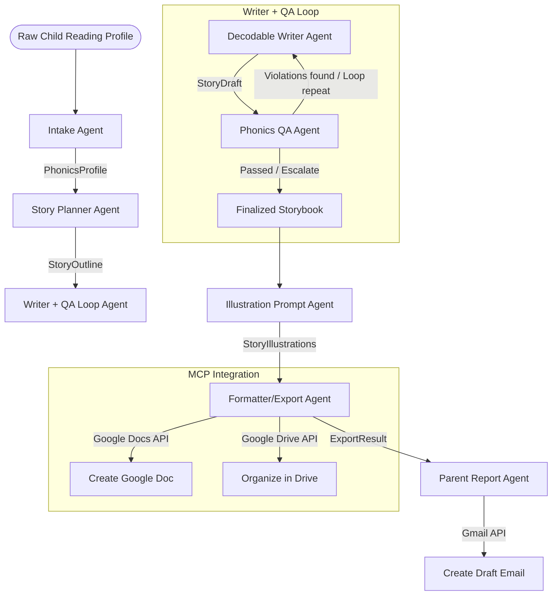

# Phono StoryForge

Phono StoryForge is a personalized decodable storybook generator capstone project built using the Google Agent Development Kit (ADK) in Python. It helps parents and educators generate highly personalized, phonically-accurate stories tailored to a child's age, specific reading profile, and interests, and exports them directly to Google Workspace.

## 🚀 Build Status: Complete & Verified
All 7 agent stages are fully implemented, integrated, and verified end-to-end:
1. **Intake Agent** -> Converts raw parent/teacher input into a structured `PhonicsProfile`.
2. **Story Planner Agent** -> Designs a `StoryOutline` with phonics-appropriate characters, setting, and beats.
3. **Decodable Writer Agent** -> Writes the story pages page-by-page.
4. **Phonics QA Loop Agent (Security Guardrail)** -> Deterministically audits the draft for phonics violations, loop-revising until 100% decodable.
5. **Illustration Prompt Agent** -> Generates cohesive, child-friendly illustration prompts using tailored style guides and age-band overrides.
6. **Formatter/Export Agent (MCP)** -> Formats the book and exports it to Google Docs and Google Drive via Model Context Protocol (MCP) servers.
7. **Parent Report Agent (Gmail/MCP)** -> Generates a warm, educational progress report for the parent and creates a draft email via the Gmail MCP tool.

---

## 🏗️ Multi-Agent Architecture

Phono StoryForge leverages a sequential multi-agent system combined with a feedback-loop-based security guardrail:



### Capstone Concepts Implemented

1. **Multi-Agent Systems built with ADK**: Uses `SequentialAgent` and custom `LoopAgent` / `BaseAgent` structures to orchestrate data flow and task responsibility.
2. **Model Context Protocol (MCP) integration**: Exposes Google Drive (`@modelcontextprotocol/server-gdrive`) and Google Docs (`@modelcontextprotocol/server-google-docs`) standard servers via `McpToolset` for book export.
3. **Agent Skills**: Custom deterministic rules in `app/tools.py` act as a discrete Python skill evaluating spelling, consonant blends, silent-e, and vowel digraphs.
4. **Security Features (Guardrail Loop)**: Custom `PhonicsQAAgent` runs as a loop-based security guardrail, enforcing strict safety criteria and directing revisions until the text passes.

---

## Project Structure

```
agy-capstoneproject/
├── app/         # Core agent code
│   ├── agent.py               # Main agent logic and multi-agent pipeline
│   ├── schemas.py             # Pydantic schemas enforcing structured data contracts
│   ├── tools.py               # Deterministic rule-based phonics checker
│   ├── phonics_db.py          # Phonics level definition database
│   └── app_utils/             # App utilities and helpers
├── tests/                     # Unit, integration, and load tests
├── GEMINI.md                  # AI-assisted development guide
└── pyproject.toml             # Project dependencies
```


> 💡 **Tip:** Use [Gemini CLI](https://github.com/google-gemini/gemini-cli) for AI-assisted development - project context is pre-configured in `GEMINI.md`.

## Requirements

Before you begin, ensure you have:
- **uv**: Python package manager (used for all dependency management in this project) - [Install](https://docs.astral.sh/uv/getting-started/installation/) ([add packages](https://docs.astral.sh/uv/concepts/dependencies/) with `uv add <package>`)
- **agents-cli**: Agents CLI - Install with `uv tool install google-agents-cli`
- **Google Cloud SDK**: For GCP services - [Install](https://cloud.google.com/sdk/docs/install)


## Quick Start

Install `agents-cli` and its skills if not already installed:

```bash
uvx google-agents-cli setup
```

Install required packages:

```bash
agents-cli install
```

Test the agent with a local web server:

```bash
agents-cli playground
```

You can also use features from the [ADK](https://adk.dev/) CLI with `uv run adk`.

## Commands

| Command              | Description                                                                                 |
| -------------------- | ------------------------------------------------------------------------------------------- |
| `agents-cli install` | Install dependencies using uv                                                         |
| `agents-cli playground` | Launch local development environment                                                  |
| `agents-cli lint`    | Run code quality checks                                                               |
| `agents-cli eval`    | Evaluate agent behavior (generate, grade, analyze, and more — see `agents-cli eval --help`) |
| `uv run pytest tests/unit tests/integration` | Run unit and integration tests                                                        |

## 🛠️ Project Management

| Command | What It Does |
|---------|--------------|
| `agents-cli scaffold enhance` | Add CI/CD pipelines and Terraform infrastructure |
| `agents-cli infra cicd` | One-command setup of entire CI/CD pipeline + infrastructure |
| `agents-cli scaffold upgrade` | Auto-upgrade to latest version while preserving customizations |

---

## Development

Edit your agent logic in `app/agent.py` and test with `agents-cli playground` - it auto-reloads on save.

## Deployment

```bash
gcloud config set project <your-project-id>
agents-cli deploy
```

To add CI/CD and Terraform, run `agents-cli scaffold enhance`.
To set up your production infrastructure, run `agents-cli infra cicd`.

## Observability

Built-in telemetry exports to Cloud Trace, BigQuery, and Cloud Logging.
