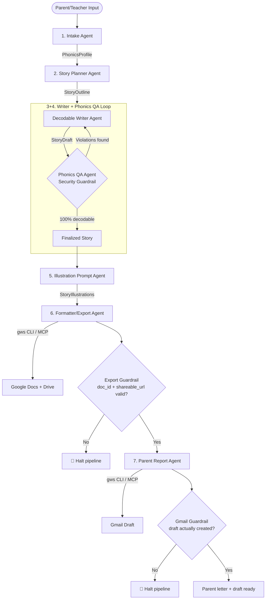

# Phono StoryForge

Phono StoryForge is a personalized decodable-storybook generator built on Google's Agent Development Kit (ADK). A parent or teacher describes a child's reading profile — age, phonics level, mastered sounds, sight words, interests — and a 7-agent pipeline writes a story that is phonically decodable at exactly that level, illustrates it, exports it to Google Docs/Drive, and drafts a personalized progress email to the parent in Gmail.

Built as the capstone project for Google/Kaggle's **5-Day AI Agents Intensive — Vibe Coding Capstone**, Track: **Agents for Good** (education).

## The Problem

Parents of dyslexic and struggling readers are told to "read decodable books at their level," but decodable books at the *exact* combination of phonics level + interests + age a given child needs are scarce, generic, and not personalized. Phono StoryForge generates one on demand, with a built-in QA loop that guarantees every word in the story is actually decodable for that child — not just "close enough."

## Status

All 7 agent stages are implemented and wired into a single `SequentialAgent` pipeline. The two real-world write paths — Google Docs/Drive export and Gmail draft creation — have been verified end-to-end against real accounts (not just mocked test runs). Three guardrails are implemented and covered by unit/integration tests. See **Known Limitations** below for the two issues that are still open and documented rather than hidden.

## Architecture



| # | Agent | File / symbol | What it does |
|---|-------|----------------|---------------|
| 1 | Intake Agent | `intake_agent` | Converts free-text input into a structured `PhonicsProfile` (age, target level, mastered levels, sight words, interest). |
| 2 | Story Planner Agent | `story_planner` | Designs a `StoryOutline` — characters, setting, plot beats — constrained to the child's phonics level. |
| 3 | Decodable Writer Agent | `writer_agent` | Writes the story page-by-page inside the loop below. |
| 4 | Phonics QA Agent (guardrail) | `PhonicsQAAgent` inside `writer_qa_loop` | Deterministic Python checker (`app/tools.py`) audits every word against the child's phonics/sight-word profile and sends violations back to the writer. Loops until clean or raises `ValueError` ("Phonics Guardrail Validation FAILED") if it can't converge. |
| 5 | Illustration Prompt Agent | `illustration_prompt_agent` | Generates page-by-page illustration prompts from the locked Phono brand (`app/brand.py`) with age-band overrides. Real image generation + on-brand verification live in the separate illustrator path — see **Illustrations** below. |
| 6 | Formatter/Export Agent (MCP + guardrail) | `formatter_export_agent` | Formats the book and exports it to Google Docs/Drive via MCP. `save_export_result` validates **both** `doc_id` and `shareable_url` before letting the pipeline continue — a real doc with a broken link still halts the run. |
| 7 | Parent Report Agent (MCP + guardrail) | `parent_report_agent` | Writes a warm progress letter referencing the real export link, and creates a Gmail draft via MCP. `save_parent_report` verifies the `create_draft` tool call actually returned a draft ID before continuing. |

### Illustrations (real cut-paper art, verified on-brand)

Beyond the in-pipeline prompt agent, a dedicated illustrator path turns a decodable book into real images. A one-per-book **character bible** is generated and stored in session state, then injected into every page prompt for cross-page character consistency. **Nano Banana** (`gemini-2.5-flash-image`, via Vertex AI) renders each page as soft cut-paper collage, and a **deterministic palette verifier** (`app/skills/palette_verifier.py`) proves every image stays on the locked Phono palette — rejecting and regenerating, or snapping, anything that drifts. The real images are embedded inline in the Google Doc (`app/doc_export.py`: Drive upload + `insertInlineImage`), with OpenDyslexic body text and a Poppins title.

This mirrors the project's core pattern — an LLM/image model proposes, deterministic Python verifies — the same way the phonics checker proves decodability. Run `python -m scripts.build_sample_book` to produce a full illustrated decodable book end-to-end in Google Docs (sample output committed under `results/sample_book/`). Image generation requires a billing-enabled Google Cloud project (the free-tier AI Studio key returns quota `limit:0` for image models), so the illustrator prefers Vertex AI.

### Capstone concepts demonstrated

- **Multi-agent systems (ADK)** — `SequentialAgent` orchestrating 6 stages, one of which (`writer_qa_loop`) is a `LoopAgent` wrapping a custom `BaseAgent` subclass.
- **MCP server integration** — Google's official `@googleworkspace/cli` (`gws`), run in MCP stdio mode via `McpToolset`, exposes Drive/Docs/Gmail write tools to the formatter and parent-report agents.
- **Security features** — three independent guardrails halt the pipeline rather than silently continuing on bad output: the phonics decodability loop, the export-result validator, and the Gmail-draft validator.
- **Agent skills** — the phonics checker in `app/tools.py` is a deterministic, non-LLM skill (spelling/blend/digraph/silent-e rules) the QA agent calls rather than trusting an LLM's judgment of decodability.
- **Deployability** — `Dockerfile` + `agents-cli deploy` / `agents-cli infra` support a path to Cloud Run; not deployed live for this submission (a public repo + setup instructions satisfies the Kaggle project-link requirement without a live demo).
- **Antigravity** — used as the AI-assisted IDE for the bulk of implementation; see the submission video for a walkthrough of that workflow.

## Known Limitations

Documented honestly rather than glossed over:

- **`gws` CLI is pinned to `0.7.0`.** Google removed MCP server mode (`gws mcp`) in `0.8.0` ([PR #275](https://github.com/googleworkspace/cli/pull/275)) due to tool-count/context bloat. `0.7.0` works today but is a deliberate pin to a version its own maintainers moved past, not a long-term fix. A future iteration would migrate to a maintained MCP wrapper or call `gws` directly via subprocess instead of MCP.
- **The eval grading harness has a JSON-parsing bug**, unrelated to the agent pipeline itself: when the LLM-judge's free-text `explanation` field contains raw newlines/markdown, `agents-cli eval grade` fails to parse it (`400 INVALID_ARGUMENT - Error parsing JSON`). This affects automated eval scoring runs, not the agent's actual behavior — `tests/unit` and `tests/integration` (which don't depend on the grading harness) pass cleanly.

## Project Structure

```
agy-capstoneproject/
├── app/
│   ├── agent.py            # 7-agent pipeline, guardrail callbacks, MCP wiring
│   ├── schemas.py          # Pydantic contracts between agents
│   ├── brand.py            # Locked Phono brand: palette, cut-paper style, prompt composers
│   ├── illustrator.py      # Real illustrations: character bible + Nano Banana + verify/regenerate
│   ├── doc_export.py       # Embed real images into the Google Doc (Drive + inline image)
│   ├── tools.py            # Deterministic phonics-checking skill
│   ├── phonics_db.py       # Phonics level reference data
│   ├── skills/
│   │   └── palette_verifier.py  # Deterministic on-brand palette check for generated art
│   └── fast_api_app.py     # FastAPI entrypoint (used by Dockerfile/deploy)
├── scripts/
│   └── build_sample_book.py  # End-to-end: generate an illustrated decodable book in Docs
├── results/
│   └── sample_book/        # Sample generated illustrated book (page PNGs)
├── docs/
│   └── illustration-style-guide.md  # Superseded by app/brand.py
├── tests/
│   ├── unit/                # guardrails, phonics, palette verifier, illustrator, doc export
│   ├── integration/          # full pipeline run (mocked MCP), failure-path test
│   └── eval/                 # agents-cli eval datasets
├── Dockerfile
└── pyproject.toml
```

## Requirements

- **Python** 3.11–3.13
- **[uv](https://docs.astral.sh/uv/getting-started/installation/)** — dependency management
- **Node.js / npm** (provides `npx`) — required to run the `gws` MCP server
- **[agents-cli](https://github.com/googleapis/agents-cli)** — `uv tool install google-agents-cli`
- **Google Cloud SDK** — needed for `gcloud auth application-default login` (required by `agents-cli eval`, even though the agent itself calls the Google AI Studio API directly)
- A Google Cloud project with Vertex AI enabled, and a Google AI Studio API key

## Setup

1. Clone the repo:
   ```bash
   git clone https://github.com/tannergriffith-beep/phono-storyforge.git
   cd phono-storyforge
   ```

2. Install dependencies:
   ```bash
   agents-cli install
   ```

3. Create `app/.env` with:
   ```
   GOOGLE_API_KEY=<your AI Studio API key>
   GOOGLE_GENAI_USE_VERTEXAI=0
   GOOGLE_CLOUD_PROJECT=<your GCP project ID>
   GOOGLE_CLOUD_LOCATION=global
   LOG_LEVEL=INFO
   ```
   The agent's own LLM calls go through the AI Studio key (`GOOGLE_GENAI_USE_VERTEXAI=0`); `agents-cli eval` still needs a real GCP project for Vertex AI evaluation.

4. Authenticate `gcloud` for eval/ADC:
   ```bash
   gcloud auth application-default login
   ```

5. Set up `gws` CLI credentials for real Docs/Drive/Gmail export. The MCP subprocess only inherits a safe-list of env vars (`HOME`, `PATH`, etc.), so credentials must go in the default file location, not environment variables:
   ```bash
   mkdir -p ~/.config/gws
   cp /path/to/your/client_secret_xxx.json ~/.config/gws/client_secret.json
   ```

6. Run it:
   ```bash
   agents-cli playground
   ```

## Testing

```bash
uv run pytest tests/unit tests/integration
```

Integration tests set `INTEGRATION_TEST=TRUE`, which swaps the real `gws` MCP toolset for plain mocked tools — this works around an ADK limitation where its function-declaration builder can't introspect a live `McpToolset`. Real MCP export/Gmail behavior is exercised through `agents-cli playground` against a real account instead.

For agent evals:
```bash
INTEGRATION_TEST=TRUE agents-cli eval generate
agents-cli eval grade
```

## Deployment

```bash
gcloud config set project <your-project-id>
agents-cli deploy
```

`Dockerfile` builds a standalone FastAPI image (`app/fast_api_app.py`) suitable for Cloud Run. Not deployed live for this submission — see Known Limitations.
