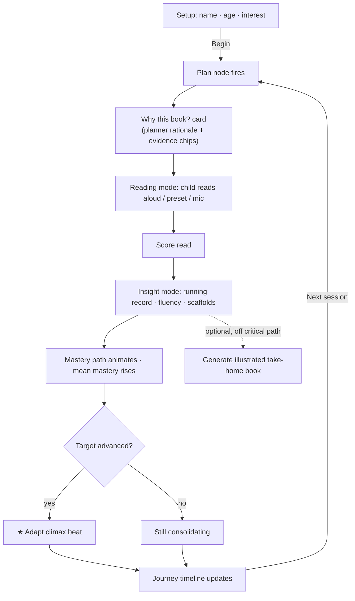
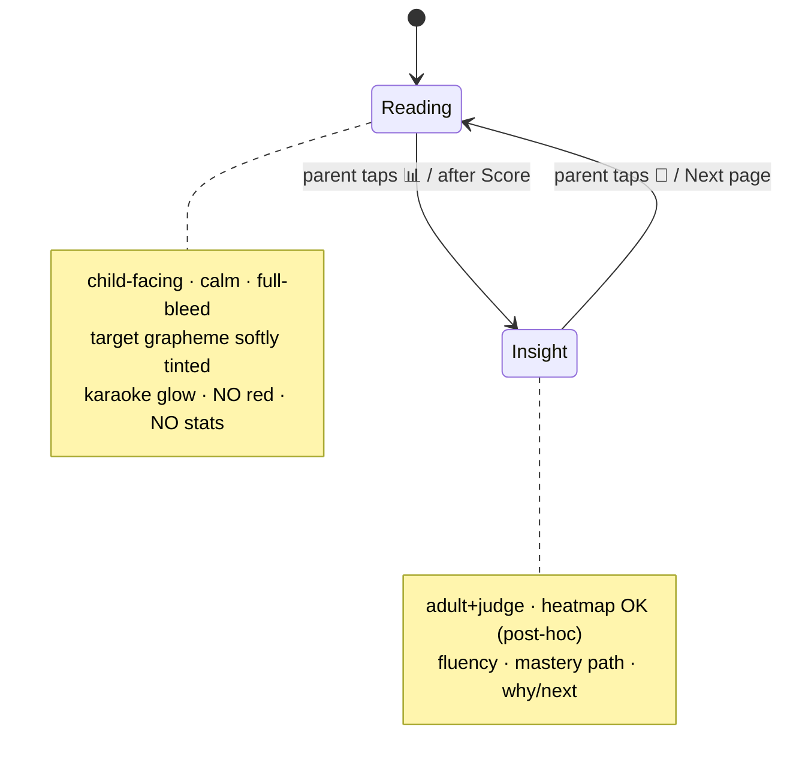

# Phono StoryForge — Design direction

> **Status:** design source-of-truth. Demo-first (the ~5-min capstone cut, July 6 2026),
> built to scale into the full product. Honors the locked brand in `app/brand.py`;
> grounds every recommendation in the real Stage C surface (`app/web/`) and the data
> `app/web/viz.py` already emits. Visual companion: the interactive showcase artifact.

---

## 0. The one-sentence thesis

**Make the loop the thing you can see.** The closed loop already runs — plan → generate →
verify → read → attribute → update. The product's remaining job is *legibility*: to a judge
in three minutes, a parent in three seconds, and a child who should only ever feel successful.

---

## 1. Product read

**It's a dyad, not a user.** A child (≈5–10) reading aloud + a co-present adult (parent,
or reading specialist/SLP) operating and interpreting. For the capstone window, a third
viewer outranks both: the **Kaggle/Google judge**. Every design call scores twice now —
usability **and** demo legibility.

| Viewer | Wants | Fears |
|---|---|---|
| **Child** | Decode a story about something I like; feel successful | Shame — seeing my misses in red, live |
| **Adult** | "Is she improving? What do we practice tonight, at the right level?" | Wasted effort; opaque, untrustworthy AI |
| **Judge** | A *real* agentic loop: decide → generate → verify → listen → attribute → update | A dressed-up one-shot prompt |

### Biggest UX risks (ranked)
1. **One surface serves three users**, so it overwhelms all three — BKT P(L), a 30-bar scroll,
   heatmap, WCPM, rationale, scaffolds, next-target all at once (`app/web/static/index.html`).
2. **The child can see their own misses in red, live** — `.book-text .w.substitution` paints a
   clinician's running record onto the child's reading page (`style.css:99`). Worst possible move
   for a dyslexia product.
3. **The thesis is a footnote** — "the target moved because of evidence" renders as a small
   `↳ advanced` badge (`app.js:347`).
4. **Reading surface isn't dyslexia-grade** — the generated Doc uses OpenDyslexic; the web reading
   page uses Trebuchet 26px. The place reading difficulty actually happens is the less accessible one.
5. **The typed transcript is the primary CTA** — makes the parent a court stenographer.

### Biggest opportunities (ranked)
1. **Split into two modes** — Reading (child) / Insight (adult+judge) — on one screen. Dissolves
   risks 1 & 2 at once.
2. **Make the loop the hero** — a persistent rail that lights per step (see §4). Highest leverage.
3. **"Why this book?"** as a Spotify-"Because you listened to…"-style reasoned moment.
4. **The "it adapted" climax** as a designed beat, not a badge.
5. **A cross-session Journey** — the persistence is your moat and currently has *no view*. It's the
   one screen that proves "loop," not "generator."

---

## 2. The reframe — build 4 experiences, not 15

The brief implied a full consumer-SaaS surface. Building it dilutes the demo and burns days you
don't have. **The capstone is won on one question: can a judge watch the loop adapt in 3 minutes?**

- **Cut for the capstone:** parent dashboard · settings · reports screen · learner CRUD ·
  multi-step onboarding · separate "choose interests" · accounts/auth. *(Real product surfaces —
  note them post-capstone.)*
- **Collapse into one Session screen:** session dashboard + reading interface + live read-along +
  mastery viz + adaptive recommendation + scaffolds. They're one screen's two faces.
- **Keep bounded & optional (already correct):** the illustrated take-home book + export — opt-in,
  off the critical path.

**Real inventory = 4 experiences:** ① Setup · ② Session (Read ⇄ Insight, in the Loop rail) ·
③ Adapt moment · ④ Journey. Three of the four are not yet designed.

---

## 3. User flows



**Mode model (the heart of it):**



---

## 4. The Loop rail (the hero object)

A persistent rail across the top of the Session screen. Six nodes; each **lights when it runs and
turns green (✓) when its guardrail passes**. The `Verify` node is your differentiator — show it.

```
① Plan → ② Generate → ③ Verify ✓ → ④ Read •→ ⑤ Assess → ⑥ Adapt → (loops to ①)
  select_   decodable    check_       child      assess +    update_from_
  objective   book      decodability  reads aloud attribute   evidence
```

It narrates the ADK architecture to the judge **and** is the app's IA spine. In the demo it lights
node-by-node as you talk (Shot 1). In the close, all nodes are green.

---

## 5. Screen inventory + per-screen discipline

| # | Screen | Emphasize | Hide | Interactive | Where AI appears |
|---|---|---|---|---|---|
| ① | **Setup** | 3 fields + big Begin | everything else | Begin → Plan fires | "Why this book" resolves on click |
| ② | **Reading** *(child)* | the words, only | all analytics, heatmap, **all red** | mic + karaoke glow | invisible transcription |
| ③ | **Insight** *(adult)* | Why→What-next chain + mastery path | per-grapheme bars (tap to expand) | tap a level/node | heatmap + clinical red OK (post-hoc) |
| ④ | **Journey** *(proof)* | sessions timeline; target shifting; mean trend | raw logs | scrub sessions | the loop *closing over time* |

**Reading mode specifics**
- Full-bleed page, **OpenDyslexic / Lexend**, 28–32px, line-height 2.0, generous letter-spacing.
- **Target grapheme softly gold-tinted *inside* words** (`--gold`, the warmth color) so the parent
  sees what's being practiced; reads as warmth, never error.
- **Karaoke glow** on the current word (Apple Music / Spotify lyrics pattern) — shows *where we are*,
  never *what you got wrong*.
- One calm mic button. No stats. No red. Nothing to parse.

**Insight mode specifics**
- **Why card** (plum): planner rationale + evidence chips ("had → 'head'", "cat → 'cot'").
- **Running record**: the existing heatmap — red is fine here, it's post-hoc and adult-facing.
- **Fluency stats**, **scaffold cues** (reuse `scaffold_for_miscue`).
- **Mastery path** replaces the 30-bar scroll (§6).

---

## 6. Mastery as a *path*, not 30 bars

The always-on 340px / 30-bar sidebar (`style.css:144`) is the overload. Replace with a **phonics
path**: graphemes as nodes along the level sequence.

- **Mastered** → sage-filled, subtle ring.
- **Current target** → coral, glowing, slightly scaled up.
- **Locked / ahead** → pearl, dashed border.
- One **hero number** (mean mastery) stays in the top bar. Per-grapheme BKT P(L) + history appear
  **on tap** (progressive disclosure — Oura/Whirl pattern).

References: Apple Fitness rings (legible goal-progress), Duolingo skill path (locked/current/mastered),
Monkeytype per-key heatmap (per-grapheme accuracy, for the Insight detail only).

---

## 7. The Adapt climax

Today: one line at `app.js:347`. It is your entire thesis. Promote to a **~1.5s choreographed beat**:

1. Rail animates ④ Read → ⑥ Adapt.
2. Mastery path advances its coral glow to the next grapheme.
3. One sentence lands: *"Ada mastered /a/. Tomorrow we practice /e/."*

This is the demo climax. Make it a moment, not a badge.

---

## 8. Navigation architecture

Single-page, no router needed for the capstone.

```
Top bar:  [📖 Phono · learner · session #]            [ Mastery ▓▓▓░ 42% ]
Loop rail: ① ② ③ ④ ⑤ ⑥  (persistent, lights per step)
Body:     [ 📖 Reading | 📊 Insight ]  ← mode toggle
            └─ stage (one of the two faces)
Footer of stage: Score read ▸ / Next session →
Coda (opt-in, hidden by default): 📚 Generate take-home book
```

Journey is a second view reachable from the top bar (or shown between sessions). Setup is the
empty state of the Session screen.

---

## 9. Component inventory

`LoopRail` · `ModeToggle` · `WhyCard` · `ReadingPage` · `KaraokeWord` · `TargetTint` ·
`MicButton` · `RunningRecord` · `FluencyStat` · `MasteryPath` · `GraphemeNode` · `ScaffoldCue` ·
`AdaptBeat` · `NextTargetCard` · `JourneyTimeline` · `SetupForm` · `GenProgress` ·
`DegradeBanner` · `MeanMeter`

All can be vanilla JS over the existing WebSocket payloads — no framework, no charting lib (matches
your Stage C constraint). `viz.py` already emits everything `MasteryPath`, `WhyCard`, and
`RunningRecord` need.

---

## 10. Design system

### 10.1 Color tokens (locked brand — roles assigned)

```css
:root{
  --navy:#192255;     /* text, top bar, darkest shapes */
  --coral:#DB7E65;    /* primary action, target, energy (fills/glows) */
  --coral-text:#C9603F; /* NEW: darker coral for text-bearing surfaces (a11y, see 10.2) */
  --gold:#EBBA7A;     /* target tint, highlights — on-dark only */
  --sage:#527164;     /* mastered / success / progress */
  --plum:#9C6D8B;     /* reasoning & "why", sparingly */
  --pearl:#ECE5DB;    /* inset surfaces, tracks */
  --parchment:#F0E9DF;/* page & card ground */
  --tundora:#483E45;  /* secondary text, soft shadow */
}
```

Semantic mapping (kept separate from accent): **success = sage**, **attention/target = coral**,
**reasoning = plum**, **warmth/highlight = gold**.

### 10.2 Contrast pairs (WCAG 2.1) — what's safe, what needs care

| Foreground | On | Ratio | Normal text | Action |
|---|---|---|---|---|
| Navy `#192255` | Parchment | ~12.3:1 | ✅ AAA | Body text — use this |
| Tundora `#483E45` | Parchment | ~8.1:1 | ✅ AAA | Secondary text |
| Sage `#527164` | White | ~5.0:1 | ✅ AA | Success labels |
| Gold `#EBBA7A` | Navy | ~7.9:1 | ✅ AAA | On-dark only |
| White | Coral `#DB7E65` | ~3.2:1 | ⚠️ AA Large only | **Button text borderline** |
| Coral `#DB7E65` | White | ~3.2:1 | ❌ Fail normal | Never small coral body text |
| Gold `#EBBA7A` | Parchment | ~1.3:1 | ❌ Fail | Gold = fills only, never text on light |

**The one real fix:** white-on-coral buttons (`button.primary`, `style.css:76`). Either set button
text ≥18px/700, **or** use `--coral-text #C9603F` (~4.6:1) for text-bearing coral and keep bright
coral for fills/glows/target.

### 10.3 Typography — three roles

| Role | Face | Size / spec | Notes |
|---|---|---|---|
| Display / UI | **Trebuchet MS** → Segoe UI, ui-rounded, system-ui | 22–58px, 700, −0.01em | Your existing web face — humanist, warm, *not* the cliché serif |
| **Reading surface** | **OpenDyslexic / Lexend** → system fallback | 28–32px, 1.9–2.0 line, +.02em tracking | Match the generated Doc; this is the a11y-critical face |
| Data | mono (`ui-monospace, SF Mono, Menlo`) | 11–18px | Graphemes `/a/`, `P(L)`, deltas, codes — structural, not decorative |

Keep running text ≤~65ch. Uppercase labels get `.10–.14em` letter-spacing. `tabular-nums` on all
columns of digits (fluency stats, P(L)).

### 10.4 Motion guidelines

| Trigger | Duration / curve | Notes |
|---|---|---|
| Loop node lights | 320ms ease-out, 150ms stagger | Green ✓ on guardrail pass |
| Mastery bar/path fill | 1000ms `cubic-bezier(.22,.61,.36,1)` | Your existing curve — keep |
| Just-mastered pop | 700ms scale 1→1.06→1 | Already great (`@keyframes pop`); pair with sage ✓ |
| **Adapt climax** | ~1500ms choreographed | Rail → path → sentence. The one place to spend motion |
| Mic recording | 1200ms pulse loop | `rec-pulse` — keep; calm, not urgent |
| All non-essential | gate on `prefers-reduced-motion` | Respect it |

---

## 11. Accessibility improvements (beyond contrast)

- **Reading surface → OpenDyslexic/Lexend**, larger line-height, word-spacing — the single biggest
  win for the actual users. (Roadmap #6.)
- **Never render misses in red on the child's live page.** Move all running-record coloring into
  Insight mode (post-hoc, adult-facing). Non-negotiable for a dyslexia product.
- **Don't encode meaning in color alone** — pair the heatmap kinds with shape/label (✓, strike-through,
  dashed underline) so it survives color-blindness. (You partly do this already.)
- Visible **keyboard focus** on every control; the mode toggle is a labeled `role="group"`.
- Mic states announced via `aria-live` ("listening", "transcribing", "heard: …").
- Honor `prefers-reduced-motion` for the rail and climax.

---

## 12. Mobile considerations

- The current 2-column grid collapses at 880px (`style.css:165`) — good start, but the 30-bar
  sidebar is the problem; the **path** collapses far more gracefully (horizontal scroll or wrap).
- Reading mode is *better* on mobile/tablet (full-bleed, one task) — likely the real-world parent+child
  context (a tablet on the couch). Design Reading mode mobile-first.
- Loop rail on narrow screens: shrink to icons-only with the active node labeled.
- Mic + large tap targets (≥44px) for the child.
- Mode toggle stays a thumb-reachable segmented control.

---

## 13. Future enhancements (post-capstone)

- Parent dashboard (multi-session trends, "practice tonight" nudges) — Apple Health/Strava trends.
- Spotify-Wrapped-style **shareable progress recap** (great parent artifact + viral loop).
- Multi-learner / accounts; teacher/interventionist caseload view.
- Settings (voice on/off, interests, difficulty ceiling).
- The D′ flywheel surfaced in-product (every session → eval datapoint).

---

## 14. Prioritized roadmap (impact × effort)

| # | Improvement | Impact | Effort | When |
|---|---|---|---|---|
| 1 | **Loop rail** (lights per step) | ⭐ very high | low | Do first — re-stages existing events |
| 2 | **Promote the Adapt beat** (choreographed) | ⭐ very high | low | Do first |
| 3 | **"Why this book" card** | high | low | Do first — `objective.rationale` already exists |
| 8 | **Mastery path** (kill the 30-bar scroll) | high | low–med | Do first |
| 6 | **OpenDyslexic reading surface** | high (a11y) | low | Quick win |
| 7 | **Fix coral button contrast** | med (a11y) | trivial | Quick win |
| 4 | **Read ⇄ Insight split** | very high | medium | Big bet — do if time allows |
| 5 | **Journey timeline** | high | medium | Big bet — strongest "loop" proof |
| 9 | Parent dashboard / reports | med (product) | high | Post-capstone |
| 10 | Accounts / multi-learner | low (for demo) | high | Post-capstone |

**The sprint:** 1 → 3 → 8 → 2 are all high-impact and cheap (they re-stage data `viz.py` already
emits). Land those four and Shot 1 transforms. 6 & 7 are quick a11y wins. 4 & 5 are the bigger bets.

---

## 15. Mapping to the demo (`docs/video-skeleton.md`)

| Shot | Beat | What the design contributes |
|---|---|---|
| 0:00–0:30 | Problem | Loop rail appears dim, then lights — the thesis visual |
| **0:30–2:15 ★** | **Live loop adapting** | **Rail lights node-by-node as you narrate; Adapt beat is the payoff.** Load-bearing — this is why 1/2/3/8 are "do first" |
| within ★ | Voice (optional) | Reading mode + mic; calm, no red; cut cleanly to presets if Live is flaky |
| 2:15–3:45 | Evidence chart | Journey timeline bridges one-session → the n=30 study |
| 3:45–4:35 | Illustrated book | Gen progress with visible `Verify ✓` steps echoes the rail's propose/verify discipline |
| 4:35–5:00 | Close | Full rail, all nodes green |

---

---

## 16. Deep dive — the Adapt beat (frame by frame)

Fires after `Score read` when `outcome.next_target.advanced === true`. ~1.5s of choreography that
turns "a number changed" into "the AI just decided." Build a `demo-speed` flag (1.5×) so the camera
catches each beat.

| Frame | t | On screen | Narrator (sync) | Trigger |
|---|---|---|---|---|
| **F0** | 0.0s | Insight mode, read just scored. `/a/` glowing coral (current). Mean 38% | "…her best read of /a/ yet." | `outcome` received |
| **F1** | 0.0–0.3s | Loop rail ⑤ Assess → ⑥ Adapt; Adapt node lights coral, pulses | "Watch what the planner does." | `rail.node[5].lit` |
| **F2** | 0.3–0.7s | `/a/` fills sage, `pop` (1→1.26→1), ✓ stamps. Mean climbs | "She's crossed the bar on short-a—" | node `/a/` → mastered + pop |
| **F3 ★** | 0.7–1.1s | Coral glow **travels** /a/→/e/; `/e/` dashed-locked → coral current | "—so the target just *moved* to short-e." | node `/e/` → current |
| **F4** | 1.1–1.6s | Caption resolves: "Ada mastered /a/. Tomorrow we practice /e/." Adapt node ✓ | "Chosen from her reading—not a worksheet." | `caption.show` + loop arc ⑥→① |
| **F5** | hold | Settled. "Next session →" becomes primary + glows | "Let's run it again, watch it hold." | `cta.primary.glow` |

**Camera notes**
- **Hold each beat ~0.5s longer than UI-optimal** — the eye needs time the interface doesn't.
- **Sync the verb to the motion** — the glow travels ~150ms *after* you say "moved" so it lands on the word.
- **No confetti.** Pop + travel + caption is enough; confetti reads as a kids' game to a judge.
- **Always a payoff.** No-advance variant: pulse `/a/` in place — "Still building /a/ — one more story."
  The beat never falls flat.

**Wiring:** in `renderOutcome` (`app.js`), after `mastery_updates` animate, branch on
`next_target.advanced`. Sequence with a `setTimeout` chain (or Web Animations API); under
`prefers-reduced-motion`, snap straight to the end state + show the caption.

---

## 17. Deep dive — the Journey timeline

Proves "loop, not generator." A horizontal strip where **the target row shifts** (adaptation) while
**the mean row rises** (learning) — the whole thesis at a glance.

```
Ada's journey                                 7 sessions · mastery 21% → 58%

target:   a     a     e     e     i     i     o      ← shifts = the loop re-deciding
          ●─────●─────●─────●─────●─────●─────◉      ← session dots; today = coral
mastered:       ✓a          ✓e          ✓i           ← newly-mastered moments
mean:    .21   .29   .35   .41   .47   .52   .58     ← steady climb (sparkline area)
```

- **Target row** in mono; cells where the target *changed* render coral (the visible adaptation).
- **Session dots** sage; today's dot coral with a halo.
- **Mean** as a small SVG area+line sparkline, gold endpoint dot.
- **Detail on tap:** a session expands to book title, accuracy/WCPM, what advanced.
- **Empty state (session #1):** one coral dot + "Ada's journey begins — read your first story to
  start the line." The line *grows* as the loop runs; never show an empty chart frame.

**Data:** all of it is already in `SessionLog` — `session_index`, `target_grapheme`,
`mean_mastery`, `newly_mastered`. No new instrumentation; it's a read over persisted history.

**Demo bridge (Shot 3):** "Here's Ada's real arc — target moved a→e→i as she mastered each,
mastery 21→58%. Does it generalize? n=30, 40 sessions…" → cut to the evidence chart. Makes the
study feel inevitable, not abstract.

---

## 18. Deep dive — Read ⇄ Insight transition (pressure-tested)

The toggle is where "two faces of one screen" can quietly break. The safe model:

- **Pure view-switch.** Both faces render from the same received payload via `display` only — never
  re-fetches, never re-scores. Karaoke position preserved on return. (This is how the artifact mock
  works and how `viz.py`'s single payload supports it.)
- **200ms cross-fade**, not a slide. Bind a keyboard shortcut for the filmed run.
- **The transition is the privacy boundary.** After `Score`, do **not** auto-flip red miscues into
  the child's face. Show a child-safe "Great reading!" state in Reading; the *adult taps* to Insight.

| Risk | Guard |
|---|---|
| Red miscues auto-flip into the child's view | Never auto-show Insight while the child is the reader; require a tap |
| Parent misses the Adapt climax (it lives in Insight) | Notification **pip** on the Insight tab when the target advanced; in the demo, always open it |
| Toggle eats airtime mid-demo | 200ms cross-fade; keyboard shortcut; hold only on the Adapt beat, never the swap |
| State loss / accidental loop re-run | View-switch only over the received payload — no re-fetch, no re-score |
| Toggle competes with the primary CTA | Hierarchy: flow button (`Score`/`Next`) is the one primary; toggle is a quiet segmented control above the stage |
| Mobile thumb reach (the couch context) | Toggle sticky near thumb; Loop rail collapses to icons-only with the active node labeled |

**Presenter path (rehearse the taps):**
`Begin` → `Reading: preset read` → `Score` → "Great reading" beat → **tap Insight (pip)** →
**★ Adapt beat (hold ~1.5s)** → `Next session`.
The only two beats you hold on are the child-safe celebration and the Adapt climax; everything else
is a 200ms swap. Keeps Shot 1 inside its 1:45.

---

*Companion visual showcase: the interactive design artifact (palette swatches, live mockups,
roadmap quadrant, the Adapt beat you can play, the Journey strip, and a working transition demo).
This doc is the versioned source of truth.*
